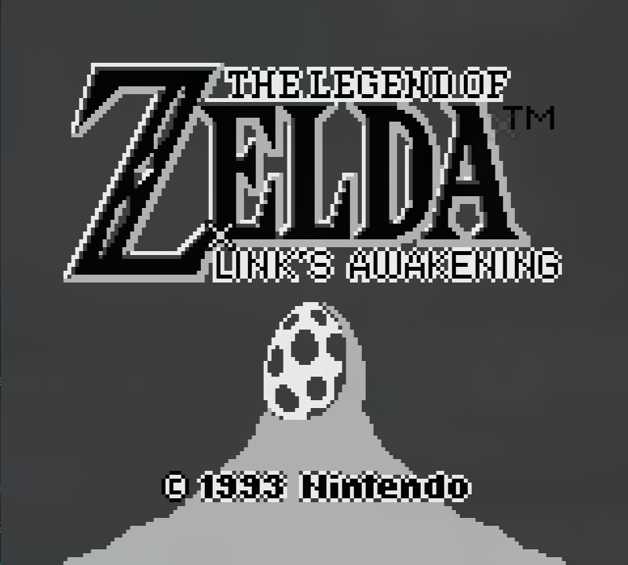
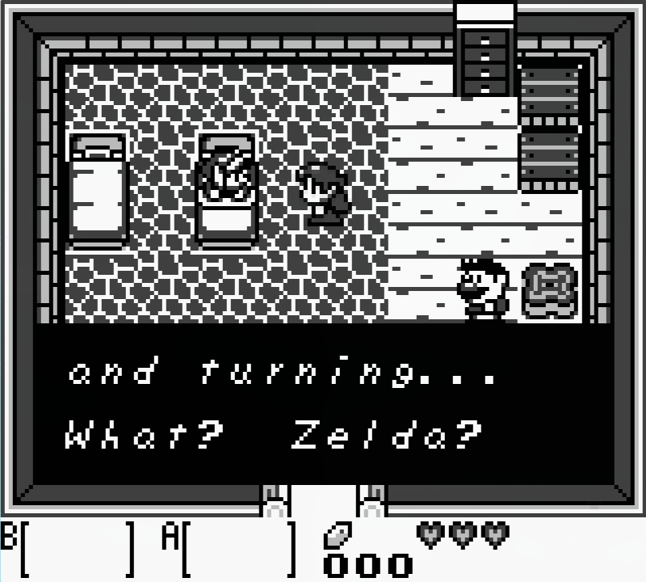
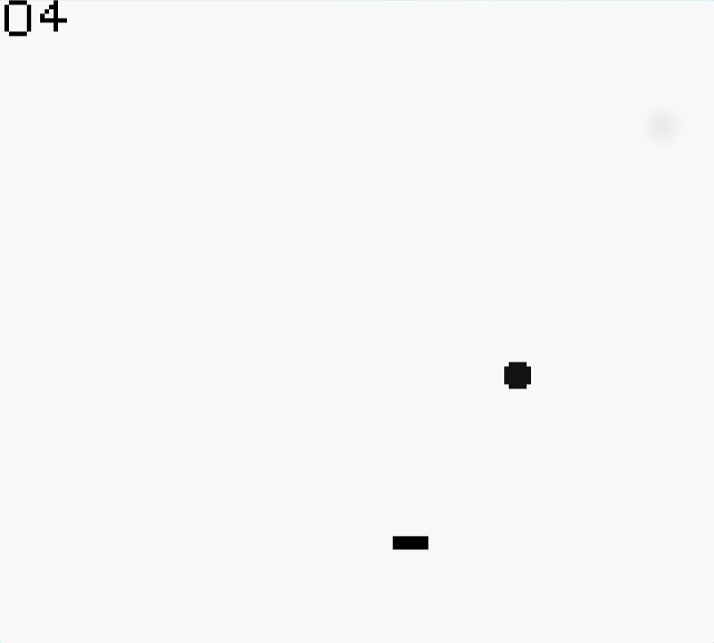

# Game Boy Emulator + Pongus

A Game Boy emulator written in C, using SDL2 for rendering and input.
As well as a pong game written in gameboy assembly.

Zelda:

Pongus:

## Features

- Emulates CPU instructions
- Renders 160x144 display via SDL
- Handles D-pad and button input
- Mostly simulates display
- Handles most interrupts

## Controls

| Key      | Action      |
|----------|-------------|
| W        | Up          |
| A        | Left        |
| S        | Down        |
| D        | Right       |
| J        | B Button    |
| K        | A Button    |
| L        | Select      |
| ;        | Start       |
| SPACE    | Boost       |
| CAPS     | Registers   |
| Q        | Quit        |

## Run

Make sure you have SDL2 installed.
Then compile with make in the root directory.
For pongus, make inside that directory, [rgbasm](https://rgbds.gbdev.io/docs/v0.5.1/rgbasm.1) is required.

Then run:
./GBemu path/to/rom.gb

Or link the rgbasmtest.asm and run the "hello world" program

Or run the PI program by [ncw](https://github.com/ncw)

## Files

* cpu.c/.h: CPU emulation (instructions, memory)
* display.c: SDL rendering, VRAM decoding, input handling
* cartridge.c: Cartridge loading, MBC1 support

## TODO

* Tile layering fix
* Batches not working for other ROMs
* Probably a million more bugs
* Sound emulation
* Other Cartridge MBC support
* Save states

## credit

* [PAN DOCS](https://gbdev.io/pandocs/)
* [RGBASM](https://rgbds.gbdev.io/docs/v0.5.1/rgbasm.5)
* [INSTRUCTION SET](https://gbdev.io/gb-opcodes/optables/)
* Nintendo lol

## License

MIT

